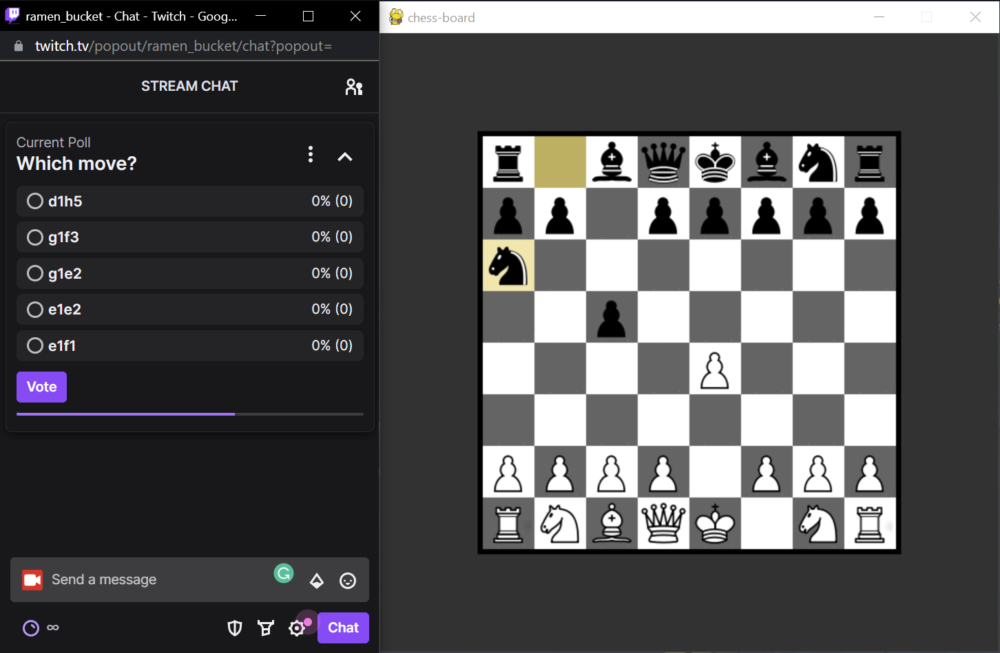

# twitch-chess

## What is twitch-chess?
A program that lets twitch chat play chess against a bot. Watch it in action [here](https://youtu.be/qXB5LhY5R0g)!

## Set-Up:
**You will need an affiliate/partnered [Twitch](https://www.twitch.tv/) account.**

1. Go to https://twitchtokengenerator.com/ and select "Custom Scope Token". In "Available Token Scopes" add scope to `chat:read`, `chat:edit`, `channel:manage:polls`, and `channel:read:polls`. Click generate token and save the information.

2. In the [.env](twitchchess/.env) file, paste your Access Token after `BOT_TOKEN=`. Then enter your twitch ID and twitch username after `USER_ID=` and `USER_NAME=`, respectively. Finally enter your twitch username after `CHANNEL=`.

3. cd into the twitchchess folder

4. In your python virtual enviornment (I used [Anaconda](https://www.anaconda.com/)), run `$ pip install -r requirements.txt`.

5.  Start the bot by entering `$ python twitchchess.py`.

## Commands (for Twitch chat):
`!init [color] [time]` - For this command, color is either "black" or "white" and time must be between 15 and 1800 seconds. By default, color is white and time is 15.

`!play` - Starts the game.

`!quit` - Stops the game.
